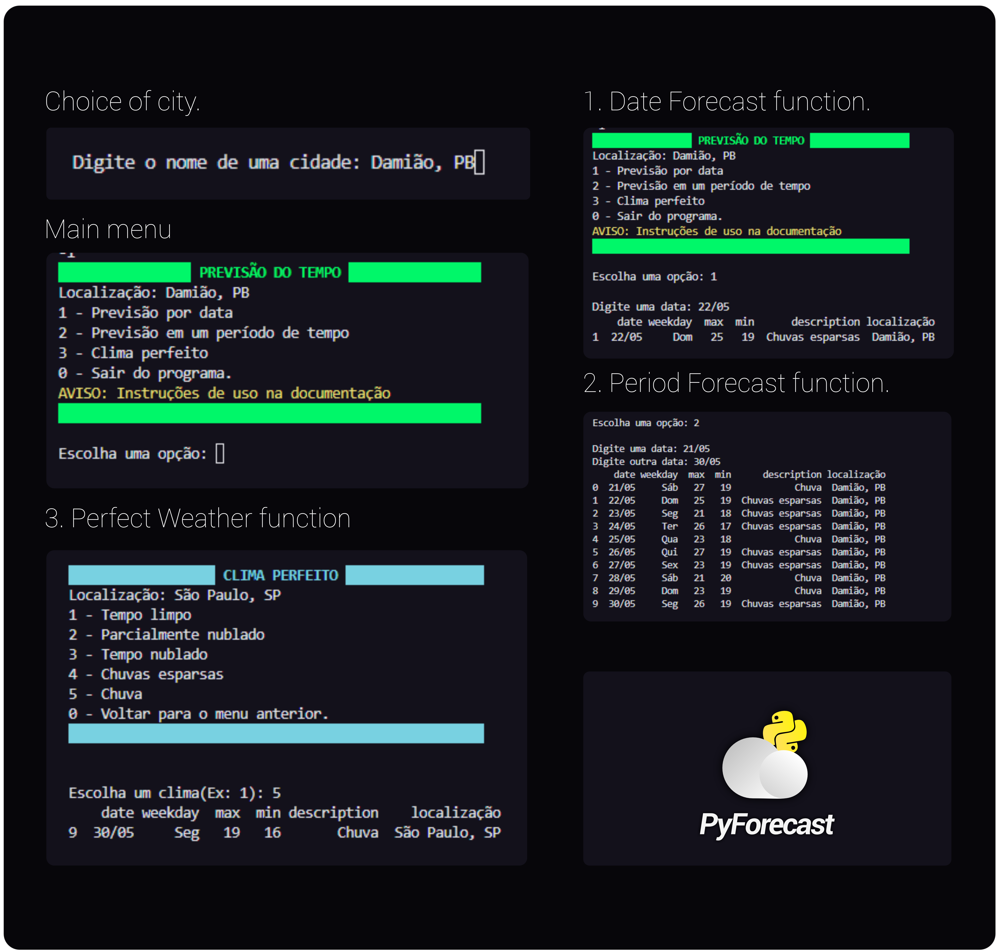

&nbsp;
<h2 style="text-align: center;">⚠️Read the instructions carefully⚠️</h2>
&nbsp;

# ☕ Description

**PyForecast** is a simple weather forecast application made in Python with the help of the pandas and requests library. The system has 4 main functions: 
* [x] <mark style="background-color: #00FF00; border-radius: 3px; padding-left: 2px; padding-right: 2px">Date Forecast</mark> - It is a function that receives from the user a location and a date, and returns a table with the weather forecast for that specified date and location.
* [x] <mark style="background-color: #00FF7F; border-radius: 3px; padding-left: 2px; padding-right: 2px">Period Forecast</mark> - It is a function that receives from the user a location, a start date and an end date, and returns a table with the weather forecast for that specified period.
* [x] <mark style="background-color: #DC143C; border-radius: 3px; padding-left: 2px; padding-right: 2px">Perfect Weather</mark> - It is a function in which the user chooses a weather that he considers perfect and the system returns a table with the days when the weather will be in the condition informed.
* [x] Create a **.csv** file that stores web requests in a table with index, acquisition date, target date, minimum and maximum temperature, location and weather condition.

The system can show the weather forecast for several cities in Brazil.

&nbsp;

# 📚 Required modules and languages:
## Used language:
* Python 🐍
## Modules:
* pandas (**pip install pandas**)
* requests (**pip install requests**)
* termcolor (**pip install termcolor**)
* unidecode (**pip install unidecode**)
* os (This module is native to Python, but can be installed by using this command **"pip install os"**)
  
The modules can also be installed using this command:

```
pip install requeriments.txt
```

&nbsp;

# 🎢 Steps taken to reach this result:

1. Requested the data with the HG Brasil API in JSON format.
2. Then I filtered the information and turned it into a DataFrame.
3. Export the dataframe to **.csv**
4. Created the <mark style="background-color: #00FF00; border-radius: 3px; padding-left: 2px; padding-right: 2px">dateForecast( )</mark> function.  
   * Returns a DataFrame with the weather forecast for a specific date.
5. Created the <mark style="background-color: #00FF7F; border-radius: 3px; padding-left: 2px; padding-right: 2px">periodForecast( )</mark> function.
   * Returns a DataFrame with the weather forecast between two different dates (MAX PERIOD: 10 days).
6. Created the <mark style="background-color: #DC143C; border-radius: 3px; padding-left: 2px; padding-right: 2px">perfectWeather( )</mark> function.
   * Returns a dataframe with the weather condition specified by the user.
7. Created the Perfect Weather function menu.
8. Created the Main menu.

&nbsp;

# 🤖 Let's see how it works:

<br>


<br>

# ⚠️ Observations to be considered:

* In the <mark style="background-color: #00FF7F; border-radius: 3px; padding-left: 2px; padding-right: 2px">periodForecast( )</mark> function, the the api only shows the forecast of a maximum of 10 days from the current date.
* You can navigate the menus using the indexes for each feature.
* The maximum daily API requests limit is **10 DIFFERENT CITIES.** CAUTION: If the limit is exceeded, the program will return an **error**!
* Create your own HG Weather API key by [Clicking Here](https://console.hgbrasil.com/documentation/weather).

&nbsp;

# 📃 License
### MIT License © [Daví Marques](https://github.com/marquesdavi). To learn more, check the license file by [CLICKING HERE](LICENSE.md).

